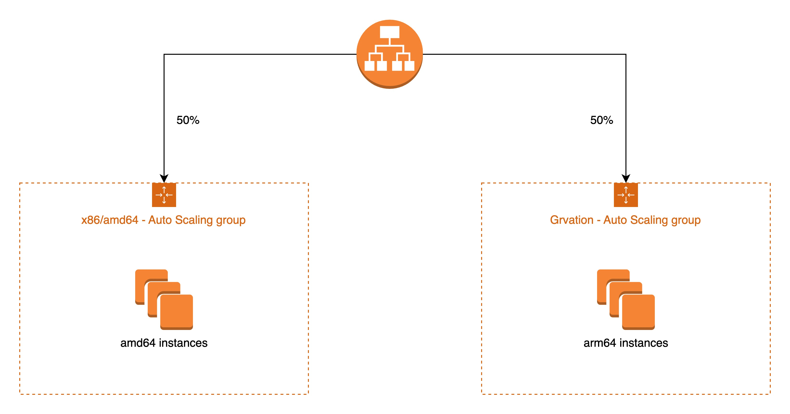

# ec2-gv-migrate-demo

This repo provides a demo of how to migrate x86/amd64 EC2 to Graviton instaces. The infrastructure is created using Terraform. See details in the `terrafrom` folder.

## Architecture

